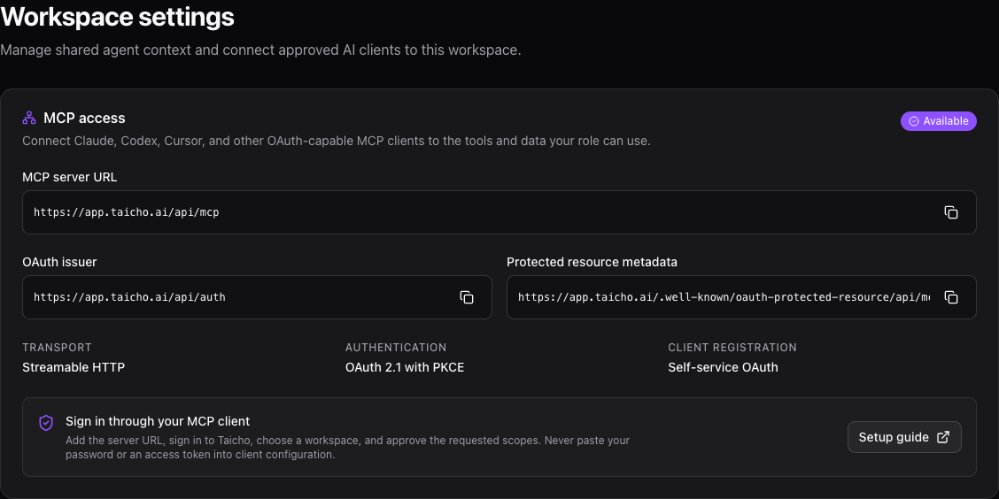
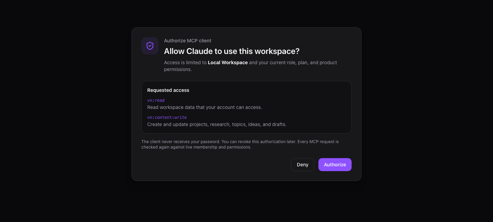

<Callout title="MCP is available" tone="success">
  Taicho exposes one remote Model Context Protocol server for your workspace. It
  uses Streamable HTTP and OAuth; you do not need to create or paste a personal
  API key into a desktop client.
</Callout>

## Get your connection details

1. As a workspace owner or administrator, open **Manage → Settings** in
   Taicho. Workspace members can use the Taicho Cloud URL below or ask an
   administrator for deployment-specific details.
2. Find **MCP access** and copy the **MCP server URL**.
3. Add that URL to your MCP client as a **Streamable HTTP** or **remote**
   server.
4. Select **Connect** or **Authenticate** in the client.
5. Sign in to Taicho, choose the workspace to connect, review the requested
   scopes, and select **Authorize**.

For Taicho Cloud, the server URL is:

```text
https://cloud.taicho.ai/api/mcp
```



The settings card also shows whether your deployment uses **Self-service
OAuth** or **Managed OAuth**. In managed mode, your deployment administrator
must provide registered client details if your MCP client asks for a client ID.



## Connect Claude

Claude connects to Taicho as a remote custom connector. This works in Claude on
the web and in Claude Desktop; the connection originates from Anthropic's cloud,
so a self-hosted Taicho endpoint must use HTTPS and be reachable from the public
internet.

### Individual Free, Pro, or Max account

1. Open **Customize → Connectors**.
2. Select **+**, then **Add custom connector**.
3. Name the connector `Taicho`.
4. Paste the MCP server URL from Taicho settings.
5. Select **Add**, then complete the Taicho sign-in and consent flow.
6. In a conversation, use **+ → Connectors** to enable Taicho.

Free accounts may be limited to one custom connector. See Claude's current
[remote custom connector guide](https://support.claude.com/en/articles/11175166-get-started-with-custom-connectors-using-remote-mcp)
for availability and network requirements.

### Team or Enterprise workspace

A Claude Owner or Primary Owner first opens **Organization settings →
Connectors**, selects **Add → Custom → Web**, and enters the Taicho MCP server
URL. Members can then open **Customize → Connectors**, find Taicho, and select
**Connect**.

If Claude shows **Advanced settings** for an OAuth client ID and secret, use
only credentials issued for that Claude connector by your Taicho deployment
administrator. Do not use a service-principal secret intended for unattended
automation.

## Connect Codex or the ChatGPT desktop app

The ChatGPT desktop app, Codex CLI, and Codex IDE extension share MCP
configuration on the same machine.

### ChatGPT desktop app or Codex IDE extension

1. Open **Settings → MCP servers**.
2. Select **Add server**.
3. Name it `Taicho`, choose **Streamable HTTP**, and paste the MCP server URL.
4. Save and restart the app or extension.
5. Select **Authenticate** beside Taicho and complete the OAuth flow.

### Codex CLI

```bash
codex mcp add taicho --url https://cloud.taicho.ai/api/mcp
codex mcp login taicho --scopes vn:read
codex mcp list
```

You can also place the server in `~/.codex/config.toml`:

```toml
[mcp_servers.taicho]
url = "https://cloud.taicho.ai/api/mcp"
auth = "oauth"
scopes = ["vn:read"]
```

Use `/mcp` inside Codex to confirm that the server is connected. See OpenAI's
current [MCP configuration guide](https://learn.chatgpt.com/docs/extend/mcp)
for client-specific controls and tool approval settings. Add only the write
scopes your workflow needs before authenticating again.

ChatGPT Work on the web uses remote MCP tools supplied by installed plugins; it
does not read your local Codex configuration. A workspace administrator must
install or approve the corresponding MCP-backed plugin before Taicho tools
appear there.

## Connect Cursor

Add a global server in `~/.cursor/mcp.json`, or add the same configuration to
`.cursor/mcp.json` in a trusted project:

```json
{
  "mcpServers": {
    "taicho": {
      "url": "https://cloud.taicho.ai/api/mcp"
    }
  }
}
```

Open Cursor's MCP settings, find **taicho**, and select **Connect** to complete
OAuth. Cursor supports both Streamable HTTP and OAuth for remote servers. See
the current [Cursor MCP guide](https://docs.cursor.com/context/model-context-protocol)
for configuration locations and tool approval controls.

## Connect another MCP client

Choose a client that supports all of the following:

- remote **Streamable HTTP** transport;
- OAuth authorization code with PKCE;
- OAuth protected-resource and authorization-server metadata discovery; and
- the MCP protocol version advertised by the server.

Enter only the MCP server URL first. A compatible client discovers the
authorization server from:

```text
https://cloud.taicho.ai/.well-known/oauth-protected-resource/api/mcp
```

The authorization issuer is:

```text
https://cloud.taicho.ai/api/auth
```

Do not copy access tokens into tracked configuration. OAuth clients should keep
access and rotating refresh tokens in their secure credential store.

## Choose the access you need

The client asks for scopes during OAuth. Approve the smallest set that supports
your workflow. Your Taicho role, enabled products, plan, and current workspace
membership still apply even when a scope is granted.

| Scope | What it permits |
| --- | --- |
| `vn:read` | Read the workspace data your account can access |
| `vn:ai:execute` | Run credit-bearing AI and research operations |
| `vn:content:write` | Create and update content projects, research, topics, ideas, and drafts |
| `vn:content:publish` | Connect publishing destinations and manage scheduled posts |
| `vn:outreach:write` | Manage contacts in outreach, personas, research, notes, and messages |
| `vn:cascade:write` | Manage nurture journeys, enrollment, templates, and variants |
| `vn:workspace:write` | Update the agent identity and assistant threads |
| `vn:integrations:write` | Manage organization-owned outbound MCP connections |
| `vn:billing:write` | Submit plan and credit requests |
| `vn:workspace:admin` | Manage members, teams, service principals, and team credits |

An AI operation that changes a product requires `vn:ai:execute` and the
corresponding product write scope. Taicho never grants a client more access than
the signed-in person already has.

## Use MCP from cloud automation

Unattended services should use a dedicated organization service principal
instead of a person's OAuth session. A workspace owner creates the principal
from an authorized MCP session with `oauth.service_principal.create`, selects
its role and exact scope allowlist, and stores the returned secret immediately;
Taicho shows that secret only once.

The service exchanges its client credentials for a short-lived token:

```bash
curl --request POST \
  --user "$TAICHO_CLIENT_ID:$TAICHO_CLIENT_SECRET" \
  --header "Content-Type: application/x-www-form-urlencoded" \
  --data-urlencode "grant_type=client_credentials" \
  --data-urlencode "scope=vn:read" \
  --data-urlencode "resource=https://cloud.taicho.ai/api/mcp" \
  https://cloud.taicho.ai/api/auth/oauth2/token
```

Keep service principals separate by environment and workload. Never reuse one
principal across Taicho organizations.

## What the connection can do

Tool and resource discovery adapts to the scopes and products available to the
caller. Depending on access, clients can work with:

- workspace context, Brain, intelligence artifacts, and assistant threads;
- content projects, research, topics, ideas, drafts, and publishing;
- shared contacts, outreach research, qualification, notes, and messages;
- nurture journeys, templates, enrollment, and variants;
- automation definitions, runs, events, approvals, and artifacts; and
- organization members, teams, credits, and approved external integrations.

Long-running AI work returns an operation handle. Keep the client connected or
poll the returned operation resource until it completes; do not repeat the
mutation with a new idempotency key just because it is still running.

## Troubleshoot a connection

### The client says registration is unauthorized

The Taicho deployment is using managed OAuth. Ask its administrator for a
registered client ID supported by your MCP client, or ask them to enable
self-service client registration with registration rate limits.

### OAuth opens, but tools are missing

Reconnect and review the requested scopes. Tool discovery also hides
capabilities your workspace role, product entitlements, or plan cannot use.
Ask a workspace owner to confirm your role before requesting broader scopes.

### Claude cannot reach a self-hosted server

Claude's remote connector calls Taicho from Anthropic's cloud, even when you use
Claude Desktop. Confirm that the MCP URL is public, uses a valid HTTPS
certificate, and permits Anthropic's current published IP ranges through any
firewall.

### An AI operation stays queued

This is a deployment issue rather than a client issue. Ask the deployment
administrator to confirm that the Taicho MCP operation worker is running and
healthy.

### The client asks for an API key

Taicho's inbound MCP server uses OAuth, not a static personal API key. Choose
the client's OAuth or remote-server connection path. Do not use the
organization's outbound-integration credentials.
