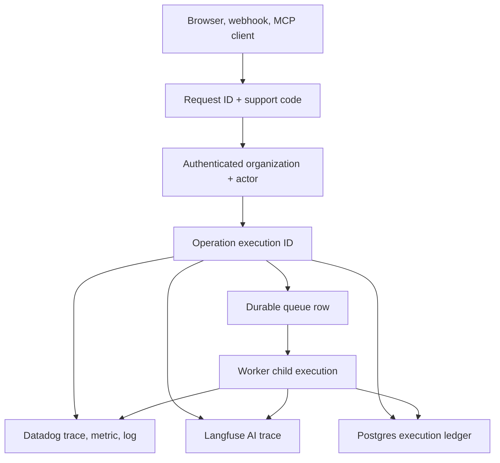
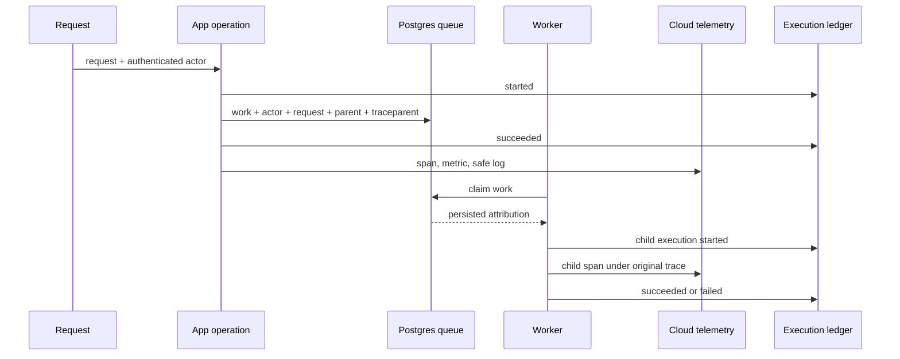

# Observability and execution attribution

Implementation guides:

- [OTL operational logging and execution history](./observability/otl-logging.md)
- [OTEL semantic workflow tracing with OpenInference](./observability/otel-tracing.md)

In this repository, **OTL** is the internal name for structured operational
logs, metrics, and the support ledger, while **OTEL** means the OpenTelemetry
trace layer used to transport the OpenInference business waterfall; OTL is not
an OpenTelemetry standard or another telemetry vendor.

The production system keeps operational logs and metrics separate from the
semantic OTLP workflow traces used to understand AI behaviour. Datadog is the
configured production operational backend, while any OTLP-compatible trace
backend can render the workflow waterfall; Langfuse remains an optional
evaluation integration rather than the only place an AI run can be understood.

Every meaningful operation has one correlation chain:



## What each system owns

| System | Purpose | Identity stored | Content policy |
|---|---|---|---|
| Operational backend (Datadog/O2) | HTTP, DB, worker, queue and provider health through structured logs and metrics | request/execution/job/run IDs plus keyed pseudonyms for organization, actor, session and business entities | prompts, messages, payloads, email addresses, raw error messages, stack traces, URL queries and SQL text are rejected |
| OTLP workflow traces | chronological AI and business workflow waterfall, including tool calls, generation, scoring, decisions and persistence summaries | request/execution IDs plus keyed pseudonyms for organization, user, session and business entities | explicit workflow inputs and outputs follow `OBSERVABILITY_WORKFLOW_CONTENT`; credential fields and email addresses are always redacted |
| Langfuse Cloud | optional AI evaluation, experiment and model-quality workspace | request/execution IDs plus keyed pseudonyms for organization, user, session and agent | configured independently of the primary OTLP workflow trace |
| Postgres `observability.execution_event` | authoritative support lookup and execution history | raw organization and actor IDs, request/execution/parent IDs, trace/span IDs | allowlisted metadata and error type/code/fingerprint only |
| Product databases | the business record and durable queues | raw tenant and actor attribution where needed to execute work | unchanged; remains inside Vector Notion's application data boundary |

The cloud pseudonyms are deterministic HMAC references. They allow grouping
without revealing the source organization, user or session ID. Production
startup fails if `OBSERVABILITY_ID_HASH_KEY` is absent.

## Identity contract

| Field | Meaning | Crosses a durable queue? | Sent to cloud? |
|---|---|---:|---:|
| `request_id` | one originating interaction | yes | yes |
| `execution_id` | one operation or worker attempt | yes | yes |
| `parent_execution_id` | the operation that created this work | yes | yes |
| `traceparent` | W3C parent trace context | yes | yes |
| `organization_id` | authoritative tenant | yes | pseudonym only |
| `actor_id` | user or service principal responsible | yes | pseudonym only |
| `actor_type` | `user`, `service`, or `system` | yes | yes |
| `session_id` | authenticated or chat session | when relevant | pseudonym only |
| `run_id` / `job_id` | durable business execution | yes | yes |
| `support_code` | human-safe lookup code, for example `TX-82K5M-3Q7CV` | derived from request ID | response header and ledger |

The browser receives only:

- `x-vector-notion-request-id`
- `x-vector-notion-execution-id`
- `x-vector-notion-support-code`

Raw organization and actor headers are internal request headers and are never
copied to the public response.

Every public HTTP boundary discards caller-supplied Vector Notion identity and
correlation headers before creating its server-owned context. Authentication
then supplies the authoritative organization and actor, so a client cannot
spoof another tenant's telemetry or ledger attribution.

## Durable propagation



Attribution is persisted for:

- automation workflow runs;
- MCP asynchronous operations and one-time media uploads;
- platform background jobs;
- CRM imports, inbound events, mutations, outbox commands and sync cycles;
- Cascade enrollments and email sends;
- scheduled publishing posts.

This is what keeps the user and trace association intact after a process
restart or a delayed retry.

## Semantic workflow trace contract

The default OTLP export uses OpenInference's AI-native semantic conventions
and function instrumentation plus a final Taicho allowlist; it is not a dump
of every instrumented library call. Phoenix renders these spans as a
LangSmith-style waterfall. A person research run is expected to read like this:

```text
research.person
├── research.person.load_context
├── research.person.plan_refresh
├── research.search.<dimension> (one parallel step per research dimension)
├── research.synthesis
├── research.person.persist_observations
├── research.person.reload_evidence
├── research.person.score
├── research.person.persist_assessment
└── research.qualification
    ├── research.qualification.load_context
    └── research.qualification.persist
```

Meaningful functions use the observability package's OpenInference-backed
`traceable` wrapper, which automatically records their readable `input.value`,
`output.value`, duration, error, AI span kind and async parent/child
relationship; `processInputs` and `processOutputs` provide a function-level
privacy and presentation boundary when raw arguments or results are unsuitable.
Grouped database reads expose the loaded records, logical read count, counts by
record type and serialized bytes materialized into the workflow, while raw
Cypher commands remain excluded. Provider functions expose the model input and
output plus request reference, tokens, credits and cost when the provider
returns them. Database persistence is summarized by records and identifiers
written; SQL, Redis commands, HTTP methods, sockets and framework rendering
spans never enter the default workflow trace.

The Node SDK runs with automatic resource detection disabled, and the exporter
rebuilds every span resource from an exact allowlist. Process commands and
arguments, executable paths, source code, usernames, host names and IDs, PIDs,
runtime details and CPU architecture therefore cannot reach the AI trace
backend even if another instrumentation package adds them upstream.

Set `OBSERVABILITY_INCLUDE_INFRASTRUCTURE_SPANS=true` only for a temporary
low-level diagnostic capture. It re-enables Node auto-instrumentation and mixes
infrastructure spans into OTLP, so it must not be the normal operator view.

## Runtime coverage

| Service | Datadog service name | Explicit operations |
|---|---|---|
| unified Next.js app | `taicho-unified` | semantic research, qualification and AI workflow spans |
| standalone outreach app | `taicho-outreach` | semantic research, qualification and outreach AI spans |
| standalone content app | `taicho-content` | semantic research, chat and content AI spans |
| Cascade worker | `taicho-cascade-worker` | each enrollment step, send and public tracking request |
| publishing worker | `taicho-publishing-worker` | token refresh, post publish and result sink |
| MCP operation worker | `taicho-mcp-worker` | each durable MCP operation |

Authenticated boundaries activate execution context explicitly, and a
privacy-safe console bridge converts remaining server-side `console.*` calls
into metadata-only structured records. The default exporter accepts only spans
marked by Taicho's workflow tracer, then applies a final credential and privacy
filter before sending them to the OTLP collector.

## Production configuration

Place these secrets in `/root/content-automation/.env`:

```dotenv
# Datadog Cloud
DD_API_KEY=...
DD_SITE=us5.datadoghq.com
DD_ENV=production

# Langfuse Cloud
LANGFUSE_PUBLIC_KEY=...
LANGFUSE_SECRET_KEY=...
LANGFUSE_BASE_URL=https://cloud.langfuse.com

# Independent application secret
OBSERVABILITY_ID_HASH_KEY=...
```

Operational settings:

```dotenv
OBSERVABILITY_LOG_LEVEL=info
OBSERVABILITY_LEDGER_RETENTION_DAYS=180
OBSERVABILITY_INCLUDE_INFRASTRUCTURE_SPANS=false
OBSERVABILITY_WORKFLOW_ONLY=false
# Keep traces explainable; credential fields and email addresses are still redacted.
OBSERVABILITY_WORKFLOW_CONTENT=full
```

Generate the identity key independently:

```bash
openssl rand -base64 32
```

`docker-compose.prod.yml` enables telemetry and the execution ledger for every
app and worker, sends OTLP/HTTP to `datadog-agent:4318`, and explicitly labels
only the privacy-bridged Node containers for log collection. PostgreSQL,
FalkorDB, Watchtower, docs and Agent logs are not bulk-exported.

## Local debugging

Use the same cloud projects with a distinct local identity-hash key and an
explicit development environment:

```dotenv
OBSERVABILITY_ENABLED=true
# Generate with: openssl rand -base64 32
OBSERVABILITY_ID_HASH_KEY=...
OBSERVABILITY_LEDGER_ENABLED=true
OBSERVABILITY_LOG_LEVEL=debug
OBSERVABILITY_INCLUDE_INFRASTRUCTURE_SPANS=false
OBSERVABILITY_WORKFLOW_ONLY=true
OBSERVABILITY_WORKFLOW_CONTENT=full
OTEL_EXPORTER_OTLP_ENDPOINT=http://localhost:6006
DD_API_KEY=...
DD_SITE=us5.datadoghq.com
DD_ENV=development
DD_VERSION=development
LANGFUSE_REALTIME=true
```

For a local AI waterfall, run Phoenix with deliberately small host limits and
send workflow-only OTLP/HTTP Protobuf traces directly to it:

```bash
docker run -d --name taicho-phoenix-local \
  --memory=512m --cpus=1 \
  -p 127.0.0.1:6006:6006 \
  -e PHOENIX_ALLOW_EXTERNAL_RESOURCES=false \
  -e PHOENIX_DEFAULT_RETENTION_POLICY_DAYS=1 \
  arizephoenix/phoenix:latest
open http://localhost:6006
```

Phoenix serves its UI and OTLP receiver on port `6006`; no Jaeger or generic
HTTP/database instrumentation is required for this view.

Start the profile-scoped local Datadog collector only when operational tracing
is needed:

```bash
docker compose --profile observability up -d datadog-agent
docker compose --profile observability exec datadog-agent agent health
```

The local collector is capped at 384 MiB. Containerized workers override the
OTLP endpoint to `http://datadog-agent:4318`; applications running directly on
the Mac use the loopback endpoint shown above. Langfuse receives `DD_ENV` as
its first-class environment and `DD_VERSION` as its release, so shared project
keys do not mix development and production traces.

## Support lookup

Ask the user for the support code from the error surface or
`x-vector-notion-support-code` response header, then query the
tenant-authoritative ledger:

```sql
SELECT
  support_code,
  started_at,
  service_name,
  operation,
  status,
  execution_id,
  parent_execution_id,
  request_id,
  organization_id,
  actor_id,
  actor_type,
  trace_id,
  job_id,
  run_id,
  duration_ms,
  error_type,
  error_code,
  error_fingerprint,
  safe_attributes
FROM observability.execution_event
WHERE support_code = $1
ORDER BY started_at;
```

Always confirm the organization before disclosing findings. Datadog can then
be filtered by `taicho.request.id`, `taicho.execution.id`, `trace_id`, or the
pseudonymous organization reference. Langfuse can be filtered by the same
request/execution metadata for AI work.

## First production checks

```bash
docker compose -f docker-compose.prod.yml config --quiet
docker compose -f docker-compose.prod.yml up -d datadog-agent
docker compose -f docker-compose.prod.yml exec datadog-agent agent health
docker compose -f docker-compose.prod.yml logs --tail=100 datadog-agent
```

Then make one authenticated request and one queued worker operation:

1. Confirm the response contains the three public correlation headers.
2. Confirm operational request details appear in the structured logs, not the workflow trace.
3. Confirm the ledger has the same request, parent execution and actor.
4. Run one AI action and confirm the OTLP trace shows a single semantic root,
   readable input/output, named tool and generation steps, model usage and cost.
5. Confirm the trace contains no generic `GET`, `POST`, `GRAPH.QUERY`, socket or
   framework spans, and that credential values and email addresses are redacted.

## Cloud controls

Configure these in the Datadog and Langfuse organizations before production:

- SSO and least-privilege support/engineering roles;
- EU or US region selected to match the customer contract;
- 30-day cloud retention unless a customer contract requires less;
- audit logs enabled;
- secret rotation ownership and an incident revocation procedure;
- monitors for elevated failed-operation rate, worker silence, queue age,
  ledger write failures, model error rate and model cost anomalies.

The Postgres ledger defaults to 180 days and deletes expired rows at service
startup. Full workflow content is the default so traces remain explainable;
deployments that cannot satisfy tenant access control, retention, region and
audit requirements must explicitly select `metadata` or `off` instead.
