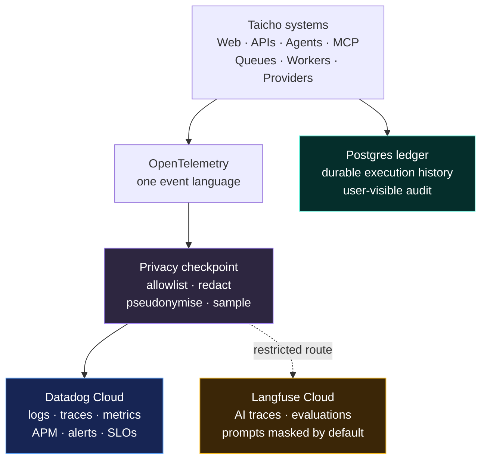
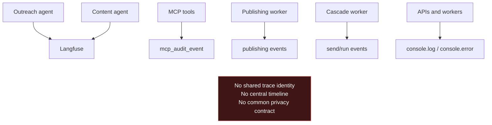
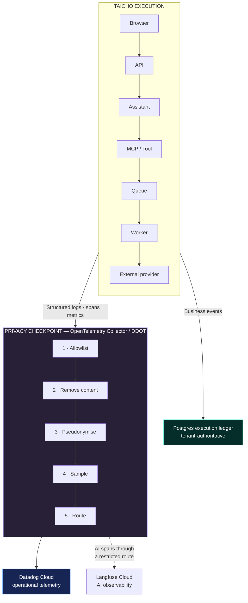
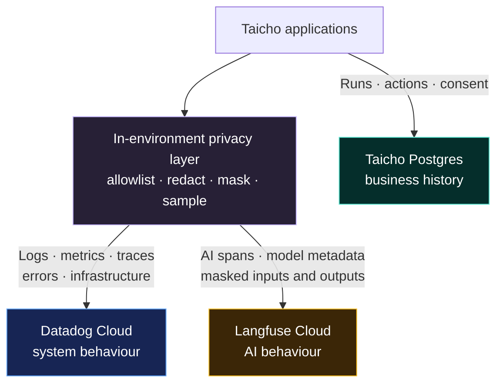
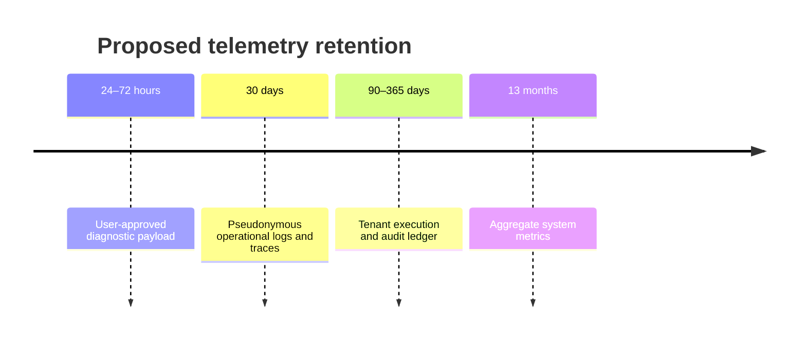
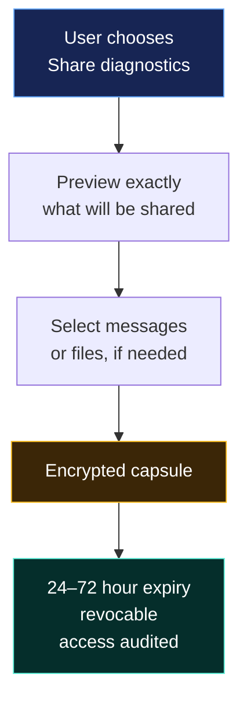
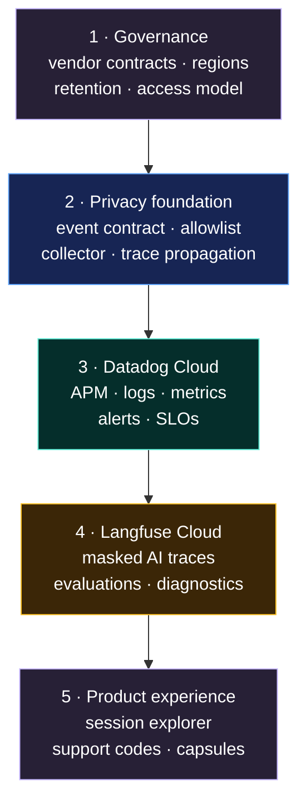

# Observability Without Surveillance

> [!abstract] The decision
> Build **one observability spine**, not one enormous data lake.
>
> - **OpenTelemetry** becomes the shared language across every system.
> - **Datadog Cloud** becomes the central operational cockpit.
> - **Langfuse Cloud** becomes the specialised AI-observability and evaluation workspace.
> - **Postgres** remains the authoritative execution and audit ledger.
> - Both cloud platforms receive only the data appropriate to their purpose.
> - User content remains **masked and excluded by default**.

---

## The idea in one picture



The key distinction is simple:

| Data type | Purpose | Home |
|---|---|---|
| Logs, traces, metrics and APM | Operate and debug the system | Datadog Cloud |
| Runs, actions and consent decisions | Product history and auditability | Postgres |
| Model behaviour, AI traces and evaluations | Improve agent quality | Langfuse Cloud |

---

## What exists today

Taicho already has good ingredients, but they do not yet form a system.



### Repository observations

- Langfuse is configured in the Outreach and Content Generator agent runtimes.
- MCP actions already record capability, outcome, duration and affected entities.
- Publishing and Cascade processes already preserve domain-specific run events.
- The repository contains roughly **286 console calls across 126 source files**.
- Some current console messages can contain prompts, email recipients or email subjects.
- There is no shared logger, global trace propagation, central explorer or formal data-retention contract.

> [!warning] The immediate privacy risk
> Unstructured logging makes it easy for user content to escape accidentally through prompts, errors, request objects and integration payloads. Centralising those logs without first introducing a privacy boundary would make the problem larger, not smaller.

---

## The target architecture



### Why OpenTelemetry sits in the middle

OpenTelemetry is the contract, not the destination.

It gives Taicho:

- One structure for logs, traces and metrics.
- Trace-context propagation through APIs, queues and MCP.
- A vendor-neutral collection layer.
- Redaction and filtering before data leaves Taicho’s environment.
- The freedom to change the operational backend later without rewriting every service.

---

## The cloud boundary

The two cloud platforms should not receive identical copies of Taicho’s data.



### Data ownership between the platforms

| Signal | Datadog | Langfuse |
|---|:---:|:---:|
| Service health, CPU, memory and infrastructure | **Primary** | — |
| API, queue and worker traces | **Primary** | — |
| Errors, retries, latency and availability | **Primary** | Metadata only |
| Model, provider, token and cost metadata | Summary | **Primary** |
| Prompt versions, AI evaluations and scores | — | **Primary** |
| Prompt and completion content | Never by default | Masked by default |
| Customer-visible execution history | Neither—kept in Postgres | Neither—kept in Postgres |

> [!important] Avoid duplicate AI surveillance
> Datadog also offers AI-observability features, but Taicho should not enable parallel prompt and completion capture in both products. Datadog receives safe model-call metadata; Langfuse owns the detailed AI-quality workflow.

---

## Region and vendor-governance profile

Cloud hosting replaces infrastructure operations with vendor governance. Region selection must happen before data is sent because moving historical observability data later can be difficult.

| Deployment profile | Datadog site | Langfuse region | Intended use |
|---|---|---|---|
| European | EU1 · Germany | EU · Ireland | European residency and GDPR-oriented deployments |
| Japan / Asia | AP1 · Japan | Japan · Tokyo | Asia-Pacific deployments |
| United States | US site selected by contract | US · Oregon | United States deployments |
| Regulated | Contract-specific eligible site | Contract-specific eligible region | Only after DPA/BAA and control review |

The platforms do not make Taicho compliant automatically. Before production use, the operating profile must record:

- The selected region and legal jurisdiction.
- Data Processing Agreements and the current subprocessor lists.
- SSO, MFA, RBAC and approved administrator roles.
- Retention and deletion settings for every data class.
- Encryption and key-management responsibilities.
- Incident-notification and support-access terms.
- A documented offboarding and data-export procedure.

> [!success] The defensible claim
> “Taicho minimises and redacts telemetry before transmission, uses region-bound cloud services under contractual data-processing terms, and applies documented access, retention and deletion controls.”
>
> The claim should never be merely: “Our vendors are compliant, therefore Taicho is compliant.”

---

## One identity for every execution

Every meaningful operation receives one connected identity:

```text
trace_id
└── execution_id
    ├── request_id
    ├── conversation_id
    ├── job_id
    ├── tool_call_id
    └── external_provider_request_id
```

The `trace_id` travels through HTTP requests, queues, agents, MCP calls, workers and external integrations.

The user sees a safe, short support code:

```text
TX-7K2M-91D
```

They can share that code without sharing their name, email address, prompt or account identity.

---

## The debugging experience

The central experience should feel like an **execution story**, not a wall of log lines.

```text
Execution TX-7K2M-91D                              Failed after 4.8s

00.000  Web request received                         ✓    42ms
00.044  Authentication and policy check              ✓    18ms
00.067  Assistant execution started                  ✓
00.231  Model response                               ✓    1.9s
02.144  Tool · integration.crm.create_lead           ✓    310ms
02.471  Queue · outreach-email                       ✓    24ms
02.619  Worker · send-email                          ✕    2.1s
        Provider error · RATE_LIMITED
        Attempt · 3/3
        Retry policy · exhausted

User content captured       No
Diagnostic payload attached No
Permission decision         Allowed
Deployment                  production / b5d150f
```

This should answer:

- Where did the execution fail?
- Which deployment was running?
- What permission decision was made?
- How many retries occurred?
- Was an external service unhealthy?
- Is this one customer’s problem or a system-wide incident?

It should not answer “What exactly did the user write?” unless the user explicitly chooses to share it.

---

## The privacy contract

### Collected by default

| Category | Examples |
|---|---|
| Operation | Service name, operation name, deployment version |
| Outcome | Status, safe error code, duration |
| Reliability | Retry count, queue delay, timeout category |
| AI metadata | Model name, token count, tool name |
| Authorisation | Capability and allow/deny decision |
| Correlation | Trace ID and pseudonymous organisation reference |

### Never collected by default

| Category | Examples |
|---|---|
| Conversations | Prompts, chat messages, generated responses |
| Outreach content | Recipient, subject, email body |
| Customer records | Lead names, profiles, notes |
| Files | Document contents, attachments |
| Secrets | Cookies, tokens, authorisation headers |
| Request payloads | Raw bodies, webhook payloads, query strings |
| Database content | Row dumps, query parameters |

Errors should become safe structured categories such as:

```text
PROVIDER_RATE_LIMITED
PROVIDER_AUTHENTICATION_FAILED
PERMISSION_DENIED
WORKER_TIMEOUT
VALIDATION_FAILED
```

They should not become uncontrolled dumps of request objects or integration payloads.

---

## Retention by sensitivity



| Layer | Identity | Suggested retention |
|---|---|---:|
| Aggregate metrics | None | 13 months |
| Operational logs and traces | Pseudonymous | 30 days |
| Execution and audit ledger | Tenant-authoritative | 90–365 days |
| Diagnostic payload | Explicitly approved | 24–72 hours |

The exact vendor retention periods can change by contract and plan. The separation between these layers should not.

---

## The diagnostic capsule

Raw context should be exceptional, visible and temporary.



### Capsule rules

- The user previews the payload before sharing.
- Content selection is granular.
- Access is time-bound and revocable.
- Every employee access is audited.
- The capsule expires automatically.
- The content never becomes part of permanent operational telemetry.

---

## Access model

```text
Support
└── Search by support code
    └── See the safe execution timeline

Engineering
└── Explore traces and system failures
    └── See opaque customer references

SRE / Operations
└── System-wide metrics, alerts and service health

Break-glass access
└── Explicit approval · short duration · fully audited
```

Direct access to raw observability storage should be limited. Most support work should happen through a small internal session explorer that exposes only the safe fields needed for diagnosis.

---

## Platform decision

| Component | Decision | Responsibility |
|---|---|---|
| OpenTelemetry | **Adopt** | Shared instrumentation and trace propagation |
| OpenTelemetry Collector / DDOT | **Adopt** | In-environment privacy checkpoint and routing |
| Datadog Cloud | **Adopt** | Operational telemetry, APM, logs, metrics, alerts and SLOs |
| Langfuse Cloud | **Adopt** | AI traces, evaluations, prompt versions, token and cost analysis |
| Taicho Postgres | **Retain** | Durable execution history, consent and customer-visible audit |
| Custom observability backend | **Reject** | Unnecessary operational and security burden |

> [!success] Recommended shape
> - **Datadog Cloud is the operational platform.**
> - **Langfuse Cloud is the AI-observability platform.**
> - **Postgres is the execution ledger.**
> - **OpenTelemetry provides one identity and one privacy boundary across all three.**

---

## Rollout



### Phase 1 — Governance

- Select matching Datadog and Langfuse regions.
- Execute the required vendor agreements.
- Define access, retention, deletion and incident-response ownership.

### Phase 2 — Privacy foundation

- Define the shared telemetry contract and privacy allowlist.
- Introduce trace propagation across every execution.
- Put the OpenTelemetry Collector or DDOT boundary in place.
- Replace uncontrolled console logging.

### Phase 3 — Datadog operational plane

- Connect APIs, MCP, queues, workers, databases and providers.
- Introduce service-level objectives and actionable alerts.
- Correlate existing product run histories with Datadog traces.

### Phase 4 — Langfuse AI plane

- Route AI spans into the selected Langfuse Cloud region.
- Enable masking, sampling and project-level retention.
- Permit raw content only for explicitly approved diagnostic capsules or internal test organisations.

### Phase 5 — Product experience

- Build the internal execution explorer.
- Give users safe support codes.
- Add the diagnostic-capsule workflow.

---

## Success criterion

The first success criterion should not be:

> “All logs are centralised.”

It should be:

> [!quote]
> Any failed execution can be located with one support code and understood without exposing the user’s content.

That creates a genuinely living observability system:

## Observe the system. Do not watch the person.

---

## Reference material

- [OpenTelemetry Collector](https://opentelemetry.io/docs/collector/)
- [OpenTelemetry: handling sensitive data](https://opentelemetry.io/docs/security/handling-sensitive-data/)
- [OpenTelemetry Collector security practices](https://opentelemetry.io/docs/security/config-best-practices/)
- [Datadog OpenTelemetry](https://docs.datadoghq.com/opentelemetry/)
- [Datadog OpenTelemetry setup](https://docs.datadoghq.com/opentelemetry/setup/)
- [Datadog Sensitive Data Scanner](https://docs.datadoghq.com/security/sensitive_data_scanner/)
- [Datadog sites and regions](https://docs.datadoghq.com/getting_started/site/)
- [Langfuse security and compliance](https://langfuse.com/security)
- [Langfuse Cloud data regions](https://langfuse.com/security/data-regions)
- [Langfuse privacy FAQ and DPA](https://langfuse.com/security/privacy-faq)
- [Langfuse SOC 2 Type II](https://langfuse.com/security/soc2)
- [Langfuse masking](https://langfuse.com/docs/observability/features/masking/)
- [Langfuse advanced tracing controls](https://langfuse.com/docs/observability/sdk/advanced-features/)
- [Langfuse MCP tracing](https://langfuse.com/docs/observability/features/mcp-tracing/)
