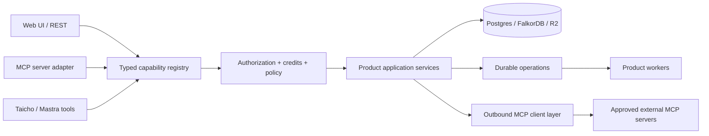

# End-to-End MCP Platform Proposal

**Date:** 2026-07-23

**Status:** Implemented on `agent/mcp-platform`; production rollout pending

**Scope:** Unified application, Content, Outreach, Nurture/Cascade, Brain, Squad/Taicho, Publishing, workspace administration, commerce, and external MCP integrations

The operational configuration, implemented surface and rollout procedure are documented in [docs/mcp.md](../../mcp.md). Where this proposal's illustrative file layout or tool spelling differs from the implementation, that runbook and the capability definitions in `packages/mcp` are authoritative.

## Executive recommendation

Make MCP a first-class interface to Vector Notion's application capabilities. The web UI, existing REST routes, Taicho/Mastra tools, background workers, and MCP should all invoke the same organization-scoped application services.

Do not implement MCP as a collection of calls from one API route to the existing HTTP routes. That would duplicate authentication, authorization, validation, billing, and error handling, and would preserve several current tenant-isolation gaps.

The proposed design has four parts:

1. A typed capability registry that is the source of truth for every user-visible query, command, and long-running operation.
2. A remote MCP server at `/api/mcp`, using Streamable HTTP and OAuth 2.1, which exposes those capabilities as resources, tools, and prompts.
3. A durable operation service for AI and other long-running work, with stable operation handles and optional MCP Tasks support when negotiated.
4. An organization-scoped outbound MCP connection layer, replacing the current hand-written CMS JSON-RPC integration and allowing approved external MCP tools to participate safely in platform workflows.

The first production gate is tenant isolation. Today, important FalkorDB, Cascade, publishing, settings, Squad, and job records are not consistently scoped to an organization. No remote MCP access—read or write—should ship until those paths are scoped and covered by cross-tenant tests.

## What “everything over MCP” means

MCP parity means every supported user or administrator outcome can be initiated, inspected, and controlled through MCP:

- read platform state through MCP resources;
- create, update, delete, generate, publish, approve, retry, or cancel through MCP tools;
- initiate costly or long-running work and inspect its progress and result;
- use curated prompts for common cross-product workflows;
- upload large media through a secure handoff and then schedule it through MCP;
- configure and use approved external MCP servers from platform workflows;
- apply exactly the same organization, role, entitlement, credit, and product rules as the web application.

Parity does not mean exposing implementation internals. Worker leasing, queue ticks, provider callbacks, OAuth callbacks, tracking pixels, unsubscribe endpoints, and token-refresh loops remain internal HTTP/worker concerns. MCP exposes the user-visible outcomes around those mechanisms: schedule, run, inspect, cancel, retry, approve, and disconnect.

## Current-state review

### Platform shape

The repository is already organized around a unified Next.js application with shared product and platform packages:

| Area | Current implementation | MCP implication |
|---|---|---|
| Content | Projects, research, topics, ideas, drafts, and publishing under `products/content` | Full read/write/generate/publish surface |
| Outreach | Leads, personas, research, qualification, notes, activities, and messages under `products/outreach` | Full CRM and AI-assisted outreach surface |
| Nurture | Funnels, steps, routing, enrollment, email assets, variants, and optimization under `products/cascade` | Expose control-plane outcomes, not send-loop internals |
| Brain | FalkorDB knowledge graph in `packages/atlas` | Read-oriented resources and search tools |
| Squad/Taicho | Agent configuration, lessons, chat, and threads in `packages/squad` and unified app routes | Agent resources, configuration tools, and durable assistant operations |
| Auth/commerce | Better Auth organizations plus plans, capabilities, roles, usage, and credits | OAuth identity must be combined with live app authorization |
| External CMS | Custom JSON-RPC client in `products/outreach/agent/cms-tools.ts` | Replace with the official MCP client stack and a connection registry |

This layout supports MCP well if the product logic is extracted from route handlers into reusable application services. It does not justify a separate MCP microservice or an internal MCP mesh.

### Important gaps to close

#### 1. Organization isolation is incomplete

Authentication is organization-aware, and `packages/auth/server.ts` builds an authorization context containing organization, role, entitlements, plan, and capabilities. However, important storage paths do not consistently carry that organization boundary:

- content and outreach graph repositories are effectively global;
- Brain, Squad lessons/agents, and workspace settings include global records or queries;
- Cascade tables do not consistently contain `organization_id`;
- publishing records are not consistently organization-scoped despite higher-level types suggesting they should be;
- job lookup and status paths can be queried without an organization boundary.

MCP makes the application remotely callable by a broader set of clients, so relying on UI routing or session context is not an acceptable substitute for data-layer scoping.

Required remediation:

- add immutable organization ownership to every product record and graph node;
- require `organizationId` in repository and service method signatures;
- include the organization predicate in every query, lookup, relationship traversal, unique constraint, and mutation;
- convert global uniqueness rules to organization-scoped composite uniqueness where appropriate;
- migrate existing data into an explicitly selected organization rather than guessing from access time;
- make Settings, Squad, Brain, publishing, Cascade, and operations organization-scoped;
- add negative cross-tenant tests at repository, application-service, REST, and MCP layers.

#### 2. MCP long-running work needs an independent durability boundary

The operation model proposed below should use its own durable operation store rather than expose an application execution detail as a protocol contract.

#### 3. The existing CMS MCP client is not protocol-complete

The current CMS integration manually sends `tools/call`, uses a fixed request ID, does not perform MCP initialization or capability negotiation, and only partially parses SSE/content results. CMS report deletion falls back to a separate REST call. The current stateful “set tenant, then call tool” pattern also creates a concurrency risk if a session is shared between organizations.

This should be replaced, not extended in place.

#### 4. A secret is committed in MCP configuration

The tracked `.mcp.json` contains a literal CMS credential. Treat it as compromised: rotate it, remove the value from the tracked file, use an environment reference or untracked local configuration, and check repository history and CI logs before deciding whether history rewriting is necessary.

#### 5. Some UI surfaces are not real platform capabilities yet

Content performance reporting is currently mock UI data, and outreach message status does not perform real email delivery. MCP must describe current behavior accurately. Those surfaces should not be advertised as analytics or message-sending capabilities until backed by actual services.

## Target architecture



### One server, shared services

Add one canonical remote MCP endpoint to the unified application:

```text
apps/unified/app/api/mcp/route.ts
packages/mcp/
  server.ts
  transport.ts
  auth.ts
  resources.ts
  tools.ts
  prompts.ts
  results.ts
  tasks.ts
packages/platform/capabilities/
  types.ts
  registry.ts
  authorize.ts
  execute.ts
  content.ts
  outreach.ts
  nurture.ts
  automation.ts
  workspace.ts
  administration.ts
packages/platform/operations/
packages/platform/integrations/mcp/
```

The MCP endpoint is an adapter. It authenticates the caller, creates an application context, filters the visible surface, invokes the registry, and translates results into MCP content. It does not call internal REST endpoints.

REST route handlers should move incrementally toward the same registry. This prevents an MCP-only fork of product behavior and gives both interfaces the same validation, billing, idempotency, audit, and error semantics.

### Capability registry

Each capability should carry enough metadata to enforce policy without duplicating it in every adapter:

```ts
type CapabilityKind = "query" | "command" | "operation";

interface Capability<I, O> {
  id: string;
  kind: CapabilityKind;
  description: string;
  input: z.ZodType<I>;
  output: z.ZodType<O>;
  product?: "content" | "outreach" | "cascade" | "automation";
  action: "read" | "create" | "update" | "delete" | "research" |
    "generate" | "publish" | "qualify" | "message" | "approve" | "admin";
  oauthScopes: string[];
  commercialCapability?: string;
  risk: "read" | "write" | "destructive" | "external-side-effect";
  billing?: { meter: string; chargeWhen: "accepted" | "completed" };
  idempotency: "none" | "optional" | "required";
  execute(context: ApplicationContext, input: I): Promise<O>;
}
```

`ApplicationContext` is constructed by trusted middleware and includes `userId`, `organizationId`, current role, entitlements, plan/capabilities, OAuth client/scopes, request and trace IDs, and billing context. A tenant-bound tool input can never select or override `organizationId`. The only exception is a separately registered platform-operator capability that explicitly targets an organization after operator authorization and enhanced audit; it never changes the caller's own context.

The registry should generate:

- MCP tool definitions and output schemas;
- MCP resource loaders/templates;
- consistent REST adapters;
- agent tool wrappers;
- an automatically testable capability manifest and reference documentation.

## Protocol profile

### Transport

Use remote Streamable HTTP at the canonical resource URL:

```text
https://<application-host>/api/mcp
```

Support the MCP-defined `POST`, `GET`, and `DELETE` behavior as applicable. Prefer stateless transport/application handling so horizontal scaling does not depend on an in-memory session. Long-running application state belongs in durable operations, not an HTTP connection.

Transport requirements:

- HTTPS only outside local development;
- validate `Origin` and `MCP-Protocol-Version`;
- enforce JSON/SSE content negotiation and body/time limits;
- use cryptographically strong IDs whenever a stateful protocol session is negotiated;
- never store application work only in a stream or server process;
- retain legacy HTTP+SSE only if a confirmed Relay client cannot use Streamable HTTP, and remove it once parity is reached.

A local stdio adapter may be offered for development, using an explicit local principal. It is not the production authentication model.

### SDK version

As of this proposal, the official TypeScript SDK repository labels v2 as beta for the upcoming 2026-07-28 protocol release and directs production users to v1.x. Pin `@modelcontextprotocol/sdk@1.29.0` now, hide it behind `packages/mcp`, and evaluate v2 only after it is stable and the compatibility suite passes. Do not build production code against the beta simply because its scheduled release is close.

### Negotiated features

Initial production profile:

- tools, resources, resource templates, and prompts;
- structured tool results plus a text fallback;
- resource links for large or durable results;
- completions where they materially improve prompt/resource arguments;
- URL elicitation for secure account/channel setup;
- progress and cancellation for operations;
- MCP Tasks only when the client negotiates the experimental capability.

Do not initially enable sampling, roots, arbitrary form elicitation for secrets, or MCP Apps. They can be added for a demonstrated workflow without changing the application capability layer.

## Authentication, authorization, and tenancy

### OAuth provider

Use Better Auth's OAuth Provider plugin, not its legacy MCP plugin, which Better Auth documents as being replaced. Configure Vector Notion as an OAuth 2.1 authorization server with:

- Authorization Server Metadata;
- Protected Resource Metadata for `/api/mcp`;
- authorization code flow with PKCE `S256` for user clients;
- dynamic client registration where policy allows it;
- resource indicators and strict audience validation;
- short-lived JWT access tokens;
- refresh-token rotation/revocation;
- a consent screen showing the client, organization, requested scopes, possible side effects, and credit use.

The token audience must identify the canonical MCP resource. Consent is bound to a selected organization. The MCP route is exempted from cookie-session proxy handling only so it can perform its own Bearer-token validation; it is not unauthenticated.

For internal machine-to-machine callers, support the MCP OAuth Client Credentials extension with dedicated service principals. Each principal is fixed to an organization and an allowlisted set of scopes. Do not use a shared platform API key or impersonate an arbitrary user.

Recommended scopes:

| Scope | Meaning |
|---|---|
| `vn:read` | Read resources in the selected organization |
| `vn:ai:execute` | Start credit-bearing AI or research operations |
| `vn:content:write` | Mutate content planning and drafts |
| `vn:content:publish` | Configure destinations and schedule/cancel/retry posts |
| `vn:outreach:write` | Mutate leads, personas, activities, and messages |
| `vn:cascade:write` | Mutate funnels, emails, enrollment, and variants |
| `vn:workspace:write` | Update the caller's workspace agent settings and Squad configuration |
| `vn:integrations:write` | Configure organization-owned outbound MCP connections |
| `vn:billing:write` | Submit plan or credit-purchase requests |
| `vn:workspace:admin` | Manage members, teams, roles, and credit allocations |
| `vn:commercial:operator` | Platform-operator plan and credit controls; never granted by default |

OAuth scope is necessary but not sufficient. Every call rehydrates current organization membership, product role, entitlement, commercial capability, and plan status. Revoking a member or feature therefore takes effect without waiting for token expiry. Existing `isAuthorized` product/action policy should become part of the shared authorization layer.

Tool discovery is filtered: a caller sees only tools permitted by token scope and current live policy. Execution repeats the same checks to avoid time-of-check/time-of-use gaps.

### Secure setup and secrets

Provider secrets, CMS keys, and social OAuth tokens should never be supplied in an LLM-visible tool argument or returned as a resource. A channel or integration setup tool returns a short-lived, single-use HTTPS URL through URL elicitation. The user completes secret or OAuth entry in the trusted Vector Notion UI; MCP can then inspect the redacted connection state.

## MCP information model

### Resources for state

Resources are the primary read interface. Return `application/json` with versioned schemas and stable entity identifiers. Use resource templates for collections and filters.

Representative resource surface:

| Domain | Resources/templates |
|---|---|
| Platform | `vectornotion://workspace/current`, `vectornotion://profile/current`, `vectornotion://operations/{id}`, `vectornotion://commerce/plans` |
| Brain | `vectornotion://brain/overview`, `vectornotion://brain/entities/{id}`, `vectornotion://brain/search{?query,types,limit}` |
| Content | projects, project entities, sources, research items, topics, ideas, drafts, counts, channels, destinations, queue, history, and per-draft posts |
| Outreach | leads and a lead bundle containing research, qualification, notes, activities, and messages; personas |
| Nurture | funnels, details, metrics, enrollments, steps, routes, email assets/templates, variants, and autonomy settings |
| Squad | agent list/detail and permitted lessons |
| Assistant | thread list/detail and operation-backed assistant responses |
| Automation | node catalog, templates, definitions, runs, run events, waits, and artifacts |
| Billing/admin | commercial summary, usage, team credit allocation, members, teams, roles, and operator overview where authorized |

For broad client compatibility, provide one read-only `platform.search` tool and one `platform.get` tool that resolve permitted resources. Do not duplicate every list/get operation as a bespoke tool.

Collection resources use cursor pagination, deterministic ordering, typed filters, and bounded page sizes. ETags or application versions should be returned where clients may update the same entity later.

### Tools for commands and operations

The target tool catalog is organized below. Exact JSON schemas come from the capability registry.

| Domain | Tools |
|---|---|
| Platform/assistant | `platform.search`, `platform.get`, `assistant.ask`, `assistant.thread.create`, `assistant.thread.delete`, `operation.get`, `operation.cancel` |
| Workspace/Squad | `workspace.agent_profile.update`, `squad.agent.update`, `squad.lesson.add`, `squad.lesson.delete` |
| Content projects/research | `content.project.create`, `.update`, `.delete`, `.ingest`; `content.research_source.create`, `.update`, `.delete`; `content.research_item.create`, `.update`, `.delete`; `content.research.run` |
| Content planning | `content.topic.create`, `.update`, `.dismiss`, `.restore`, `.reset`, `.extract`; `content.idea.create`, `.update`, `.delete`, `.generate`, `.refine`; `content.draft.create`, `.update`, `.delete`, `.generate` |
| Publishing | `content.media.create_upload`, `content.channel.start_setup`, `content.channel.disconnect`, `content.post.schedule`, `.cancel`, `.retry` |
| Outreach leads | `outreach.lead.upsert`, `.update`, `.delete`, `.research`, `.qualify`; `outreach.note.add`, `.delete`; `outreach.activity.add`, `.update`, `.delete` |
| Outreach messaging/personas | `outreach.message.create`, `.generate`, `.update`, `.delete`; `outreach.persona.create`, `.update`, `.delete` |
| Nurture funnels | `nurture.funnel.create`, `.delete`; `nurture.step.add`, `.update`, `.delete`; `nurture.route.set`, `.delete`; `nurture.contact.enroll` |
| Nurture email | `nurture.template.create`, `.update`, `.derive`, `.preview`, `.generate`; `nurture.content.create`; `nurture.email.create`; `nurture.variant.create`, `.validate`, `.approve`, `.retire`; `nurture.settings.update` |
| Billing | `billing.request_change`, `billing.credits.allocate` |
| Organization admin | `admin.member.add`, `.update_role`, `.remove`; `admin.team.create`, `.remove`, `.member_add`, `.member_remove`, `.admin_set` |
| Platform operator | `operator.plan.set`, `operator.credits.issue` |
| External MCP | `integration.mcp.create_setup`, `.update_policy`, `.test`, `.disconnect` |

Notes on parity:

- reset-all and bulk destructive actions require a dry run or explicit confirmation token;
- `outreach.message.*` creates and tracks message content/status but must not claim to deliver mail until a delivery service exists;
- content performance data is excluded until the mock UI is replaced with a real metrics service;
- public sign-in, OAuth callbacks, provider webhooks, tracking, and unsubscribe remain conventional web endpoints;
- enterprise inquiry may remain a public web form; if later needed by trusted MCP callers, add a narrowly scoped `sales.enterprise_inquiry.create` command rather than exposing anonymous writes on the primary server.

### Prompts for common workflows

Prompts are curated argument templates with no side effects:

- `content.from_project`
- `content.from_research`
- `outreach.first_touch`
- `nurture.funnel_from_goal`
- `automation.from_outcome`
- `publishing.short_video`
- `workspace.brief`

Prompt output guides the host to the relevant resources and tools. It does not bypass tool authorization or credit confirmation.

## Long-running operations and Tasks

Create a durable, organization-scoped operation service for research, generation, ingestion, assistant responses, and other asynchronous work. A representative record contains:

```text
id, organization_id, requested_by_user_id, oauth_client_id
capability_id, entity_type, entity_id, input_hash
status, progress, result_resource_uri, error_code
idempotency_key, credit_reservation_id
lease_owner, lease_expires_at, attempts, available_at
created_at, started_at, finished_at, expires_at
```

Use Postgres leases, `FOR UPDATE SKIP LOCKED`, bounded retries, heartbeats, cancellation, and persisted results/events. The existing automation runtime provides the repository's strongest implementation pattern.

Every asynchronous tool must have a stable fallback independent of experimental MCP support:

```json
{
  "operationId": "op_...",
  "status": "queued",
  "resourceUri": "vectornotion://operations/op_..."
}
```

When the client negotiates MCP Tasks, adapt that same operation to a Task. Tasks are not a second queue and are not the only way to observe the work. Publishing posts and automation runs retain their specialized engines; the operation layer links to their canonical resources instead of reimplementing them.

Credit handling must be explicit and idempotent: reserve once when work is accepted, settle once on the documented completion point, and release/refund on terminal failure according to existing product policy.

## Publishing and large media

Do not send videos or other large binaries as base64 tool arguments. Add an MCP-friendly two-step flow:

1. `content.media.create_upload` returns a short-lived presigned R2 upload URL, required headers, maximum size, checksum requirements, and a pending `mediaKey`.
2. The client uploads directly to R2, then calls `content.post.schedule` with the `mediaKey`, destination, copy, and schedule.

The server validates ownership, completion, media type, size, checksum, and malware/transcoding policy before scheduling. This closes the current gap where lower-level publishing accepts a media key but the public publish route does not expose a complete upload flow. It also provides a clean migration path for Relay-based short-video scheduling.

## Outbound MCP support

Add an organization-scoped `mcp_connections` store containing:

- endpoint and canonical server identity;
- encrypted authentication reference, never raw secret output;
- enabled/disabled state;
- exact allowed tool names and optionally pinned input-schema hashes;
- discovered server capabilities and protocol version;
- organization, creator, last test, last use, and audit timestamps.

Use the official SDK client and `StreamableHTTPClientTransport` to perform initialization, version/capability negotiation, discovery, structured result handling, progress, cancellation, sessions, and reconnects. Replace both `cms-tools.ts` and the CMS REST deletion exception behind this adapter. Prefer adding the missing delete capability to the CMS server so the integration has one protocol contract.

External servers and their descriptions are untrusted input:

- production endpoints are HTTPS only;
- block loopback, link-local, metadata, and private network destinations unless an explicit internal allowlist permits them;
- revalidate DNS and every redirect to prevent SSRF rebinding;
- enforce connection, response-size, stream, and total-operation limits;
- allowlist exact tools; never forward an external server's full discovered inventory automatically to agents or inbound MCP clients;
- redact external results from logs and apply product data-loss policy before sending organization content;
- do not accept tool-schema changes silently when a schema has been pinned.

The CMS server should accept tenant/organization identity on every relevant call. Until it does, isolate and serialize sessions per tenant; never share mutable “active tenant” state between concurrent operations.

## Mutation safety and result contracts

All mutating tools require an idempotency key. Persist the result against `(organization, OAuth client, capability, idempotency key)` so a retried network request cannot duplicate a publish, enrollment, generation charge, member invitation, or credit allocation.

Updates should accept an `expectedVersion` where concurrent edits are plausible. Deletes and external side effects should support dry-run plans or explicit confirmation tokens. MCP tool annotations should accurately declare read-only, destructive, and idempotent behavior, but server enforcement must not depend on clients honoring annotations.

Successful tools return both:

- `structuredContent` conforming to the declared output schema;
- a concise text summary for hosts that do not fully consume structured results.

Large results return a resource link rather than embedding an unbounded payload.

Expected application failures use `isError: true` with a stable structured envelope, for example:

```json
{
  "code": "INSUFFICIENT_CREDITS",
  "message": "This operation requires additional credits.",
  "retryable": false,
  "details": { "required": 10, "available": 4 }
}
```

Use JSON-RPC protocol errors only for malformed or unsupported protocol requests. Standardize at least `UNAUTHENTICATED`, `FORBIDDEN`, `FEATURE_UNAVAILABLE`, `VALIDATION_FAILED`, `NOT_FOUND`, `CONFLICT`, `RATE_LIMITED`, `INSUFFICIENT_CREDITS`, `DEPENDENCY_FAILED`, and `INTERNAL`.

## Auditing and operations

Create an append-only MCP audit stream containing request/trace ID, timestamp, organization, user/service principal, OAuth client, capability/tool, affected entity IDs, status, duration, idempotency key, credit impact, and redacted error class. Do not log access tokens, credentials, raw provider responses, or full content by default.

Add:

- per-principal, per-client, per-organization, and per-tool rate limits;
- concurrency limits for expensive AI and publishing operations;
- OpenTelemetry spans across MCP, capability, worker, and outbound MCP calls;
- metrics for discovery, invocation, authorization failures, latency, operation state, retry, cancellation, credit settlement, and external dependency health;
- alerts for cross-tenant query failures, repeated authorization denials, stuck leases, unusual destructive actions, and outbound SSRF denials.

## Delivery plan

### Phase 0 — security and tenancy gate

- rotate and remove the committed CMS credential;
- add organization ownership to all product data paths and migrate existing data;
- scope jobs, settings, Brain, Squad, Cascade, publishing, content, and outreach;
- land cross-tenant repository/service tests;
- define the OAuth resource, issuer, scopes, service-principal policy, and consent UX.

**Exit criterion:** two organizations cannot observe or mutate one another through direct repositories, services, REST, or an MCP test adapter.

### Phase 1 — shared capability layer

- introduce the registry, application context, result/error types, policy enforcement, idempotency, and audit hooks;
- move representative REST routes from every domain onto the registry;
- generate a capability manifest and schema tests;
- preserve existing UI behavior while the refactor proceeds.

**Exit criterion:** one read, one write, and one asynchronous operation per domain execute through shared services with REST parity.

### Phase 2 — authenticated read-only MCP

- add Better Auth OAuth Provider configuration, metadata, consent, and Bearer validation;
- add the Streamable HTTP endpoint, initialization, filtered discovery, resources/templates, `platform.search`, and `platform.get`;
- add protocol conformance, authorization, rate-limit, and tenant-isolation tests.

**Exit criterion:** approved clients can discover and read every real platform domain, with no mock data or cross-tenant leakage.

### Phase 3 — safe synchronous writes

- expose CRUD tools with output schemas, idempotency, optimistic versions, confirmations, and audit;
- add secure URL-based integration/channel setup;
- expose workspace/admin tools under restrictive scopes.

**Exit criterion:** MCP and REST produce equivalent state and errors for the same authorized command.

### Phase 4 — durable AI and task operations

- replace in-process jobs with durable operations;
- expose generation, research, qualification, extraction, template generation, and assistant work;
- adapt operations to negotiated MCP Tasks while retaining operation resources/tools;
- verify cancellation, restart recovery, retry, and single credit settlement.

### Phase 5 — publishing, Nurture, and Automation parity

- add R2 presigned media upload and media validation;
- expose publishing schedule/cancel/retry and destination state;
- expose Nurture and Automation control-plane tools, run resources, approvals, and artifacts;
- run end-to-end Relay migration scenarios.

### Phase 6 — outbound MCP and legacy retirement

- add connection registry, encrypted auth references, allowlists, SSRF controls, and observability;
- migrate CMS calls to the official client adapter and eliminate the REST exception;
- add internal service-principal flows;
- retire superseded Relay/custom MCP code after behavior and rollback verification.

## Verification strategy

### Contract and protocol

- initialize/version/capability negotiation across supported MCP hosts;
- schema validation for every input, structured result, resource, prompt, and error;
- Streamable HTTP JSON and SSE paths, session teardown, cancellation, disconnect, and reconnect;
- conformance checks against the pinned SDK/spec version and upgrade tests before changing it.

### Security

- cross-tenant reads, searches, relationship traversal, mutations, operations, and resource links;
- expired/revoked tokens, wrong audience/resource, missing scope, removed membership, downgraded plan, and stale consent;
- confused-deputy attempts using an organization ID in inputs or resource URIs;
- SSRF via DNS rebinding, redirects, IPv6/private ranges, and oversized/never-ending external MCP responses;
- secret redaction in logs, audit, errors, operation results, and model-visible content.

### Behavioral parity

For every capability, run the same fixture through the application service, REST adapter, and MCP adapter, then compare persisted state, result schema, authorization, billing, and audit events. Generate the matrix from the registry so new UI/API capabilities cannot silently omit MCP coverage.

### Reliability

- duplicate delivery of every mutating call;
- process restart during AI generation, publishing, automation, and outbound MCP calls;
- lease expiry, retry exhaustion, cancellation races, and partial dependency failure;
- repeated publish, enrollment, member invite, and credit-allocation requests with the same idempotency key;
- load and backpressure tests per organization and expensive operation type.

## Release gates

Production MCP is ready only when:

1. all persisted user-visible data is organization-scoped and tested;
2. every exposed capability uses the shared authorization and entitlement layer;
3. every mutation is idempotent and audited;
4. long-running work is restart-safe and cancellable;
5. OAuth audience, scope, organization, and live-membership checks pass adversarial tests;
6. secrets never traverse model-visible arguments or results;
7. the capability manifest shows intended coverage for each real UI/API outcome;
8. at least two representative MCP hosts and one internal service principal pass the compatibility suite;
9. outbound MCP passes SSRF, allowlist, timeout, redaction, and schema-drift tests;
10. the committed CMS credential has been rotated and removed.

## Decisions and non-goals

- **Decision:** one MCP server surface backed by shared application services.
- **Decision:** OAuth 2.1 with Better Auth OAuth Provider; no shared API keys for the platform server.
- **Decision:** tenant-bound organization comes only from trusted auth context, never a tool argument; isolated operator capabilities may explicitly target another organization under operator authorization and enhanced audit.
- **Decision:** stable operation resources are the baseline; experimental MCP Tasks are an adapter.
- **Decision:** use the production v1 SDK now and isolate the SDK for a later v2 upgrade.
- **Decision:** MCP covers user-visible outcomes, not worker/provider implementation endpoints.
- **Decision:** large media moves directly through R2 presigned uploads.
- **Non-goal:** making MCP an internal service bus between packages in the monolith.
- **Non-goal:** exposing arbitrary third-party MCP tools automatically to users or agents.
- **Non-goal:** reproducing mock analytics or describing content-status updates as real delivery.
- **Non-goal:** replacing OAuth callbacks, webhooks, tracking, or unsubscribe HTTP endpoints with MCP.

## Primary protocol references

- [MCP 2025-11-25 specification](https://modelcontextprotocol.io/specification/2025-11-25)
- [MCP Streamable HTTP transport](https://modelcontextprotocol.io/specification/2025-11-25/basic/transports)
- [MCP authorization](https://modelcontextprotocol.io/specification/2025-11-25/basic/authorization)
- [MCP tools](https://modelcontextprotocol.io/specification/2025-11-25/server/tools)
- [MCP resources](https://modelcontextprotocol.io/specification/2025-11-25/server/resources)
- [MCP prompts](https://modelcontextprotocol.io/specification/2025-11-25/server/prompts)
- [MCP Tasks extension](https://modelcontextprotocol.io/extensions/tasks/overview)
- [MCP OAuth Client Credentials extension](https://modelcontextprotocol.io/extensions/auth/oauth-client-credentials)
- [Official MCP TypeScript SDK](https://github.com/modelcontextprotocol/typescript-sdk)
- [Better Auth OAuth Provider](https://better-auth.com/docs/plugins/oauth-provider)
- [Better Auth MCP plugin deprecation guidance](https://better-auth.com/docs/plugins/mcp)
