# Taicho Chatbots

## 1. Problem → Shape

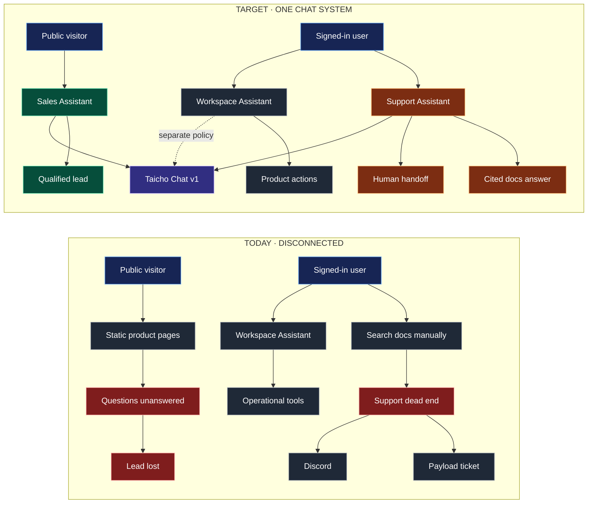

## 2. System

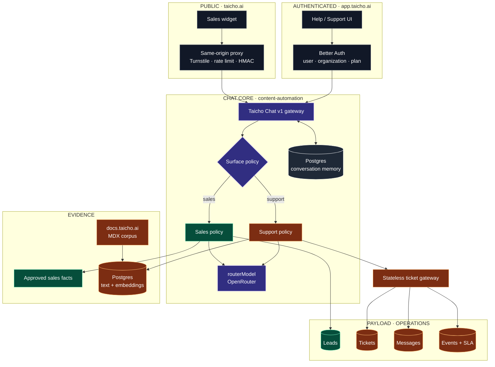

## 3. Shared Chat Contract

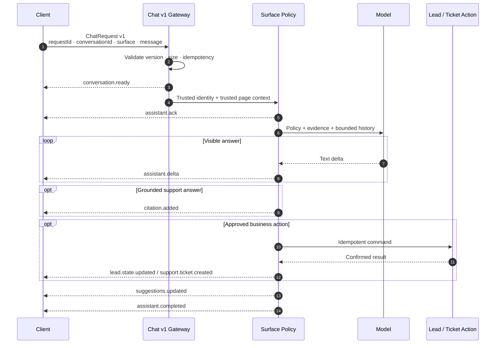

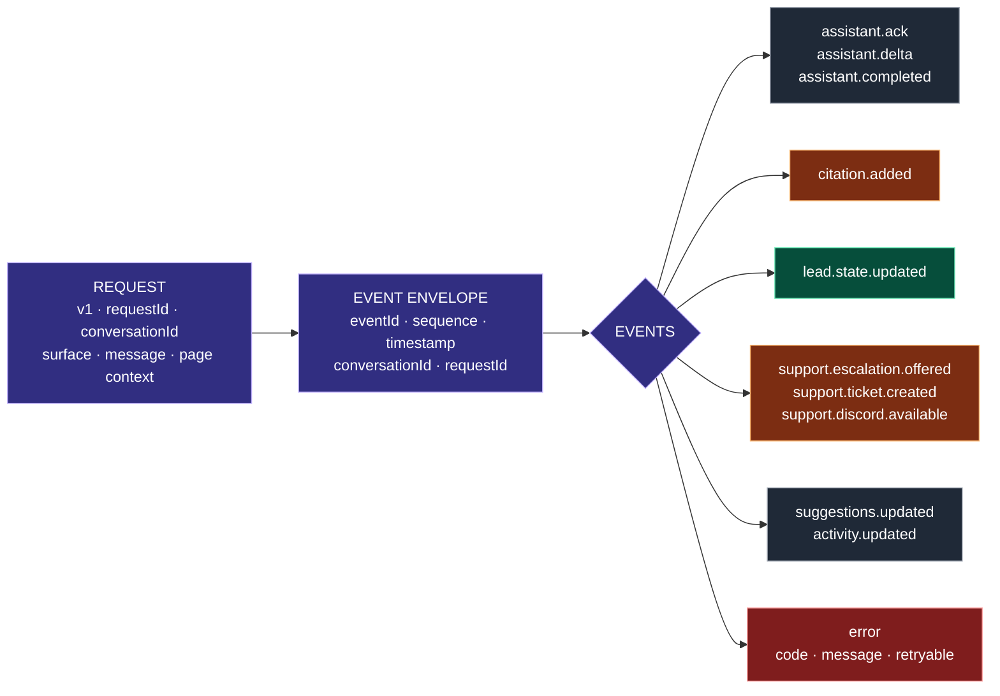

## 4. Sales Assistant

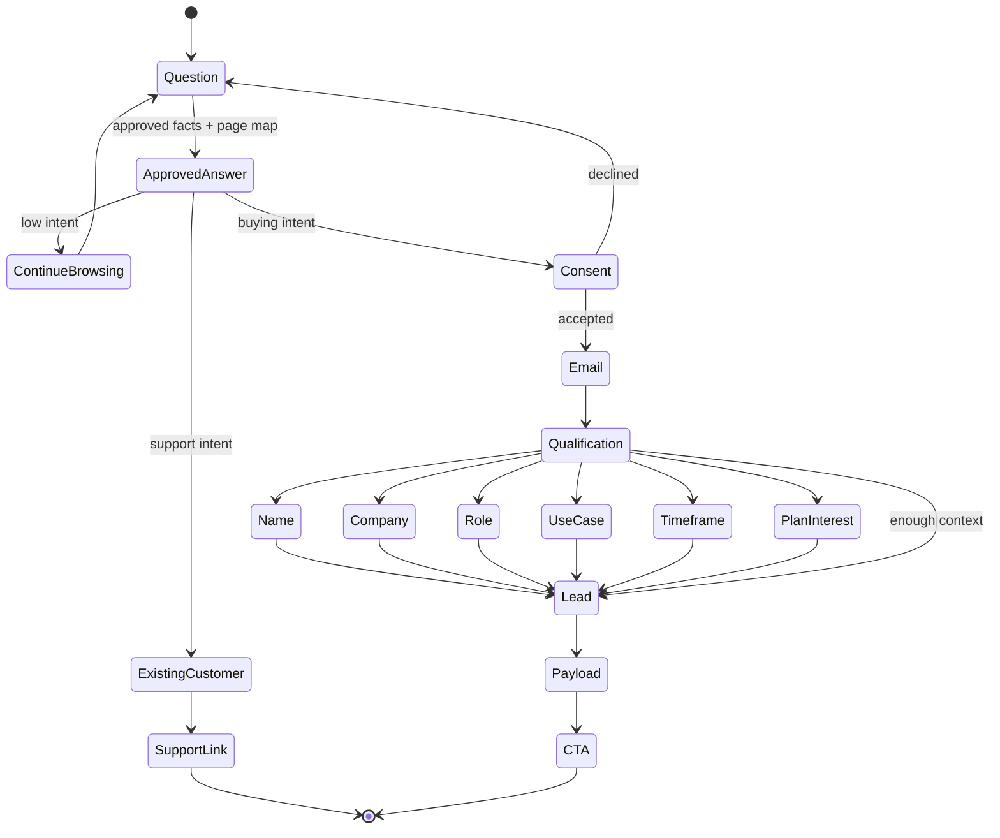

```mermaid
flowchart LR
    PAGE["Trusted page path"] --> MAP["Server page map"] --> FACTS["Approved facts<br/>product · plans · pricing · enterprise"] --> ANSWER["Useful answer first"] --> INTENT{"Buying intent?"}

    INTENT -->|"No"| NEXT["Question / trusted CTA"]
    INTENT -->|"Yes"| CONSENT{"Consent?"}
    CONSENT -->|"No"| NEXT
    CONSENT -->|"Yes"| FIELDS["Email + optional qualification"]
    FIELDS --> SUMMARY["Factual summary"]
    SUMMARY --> LEAD[("Payload Lead<br/>tenant = taicho<br/>source = sales_bot")]

    CLIENT["Client page title / text"] -.->|display only| PAGE
    CLIENT -.->|never trusted instructions| FACTS

    classDef trusted fill:#064e3b,stroke:#6ee7b7,color:#fff
    classDef decision fill:#312e81,stroke:#c4b5fd,color:#fff
    classDef untrusted fill:#7f1d1d,stroke:#fca5a5,color:#fff

    class PAGE,MAP,FACTS,ANSWER,NEXT,FIELDS,SUMMARY,LEAD trusted
    class INTENT,CONSENT decision
    class CLIENT untrusted
```

## 5. Support Assistant

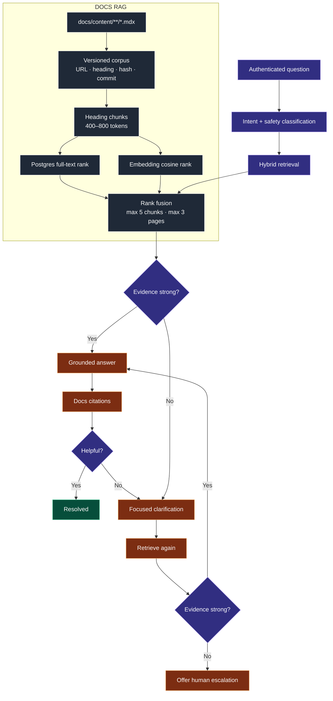

## 6. Human Handoff

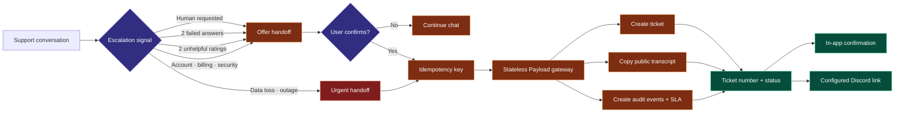

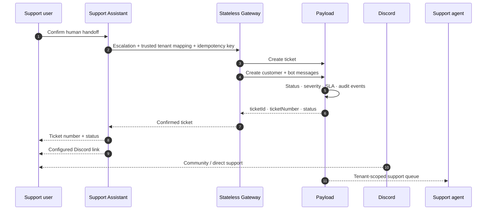

## 7. Data Ownership

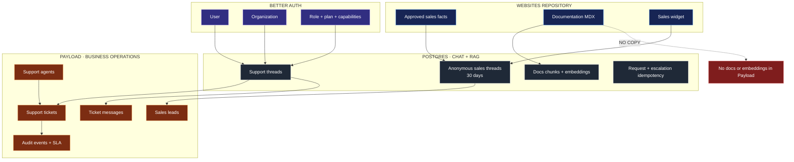

## 8. Tenant + Trust Boundaries

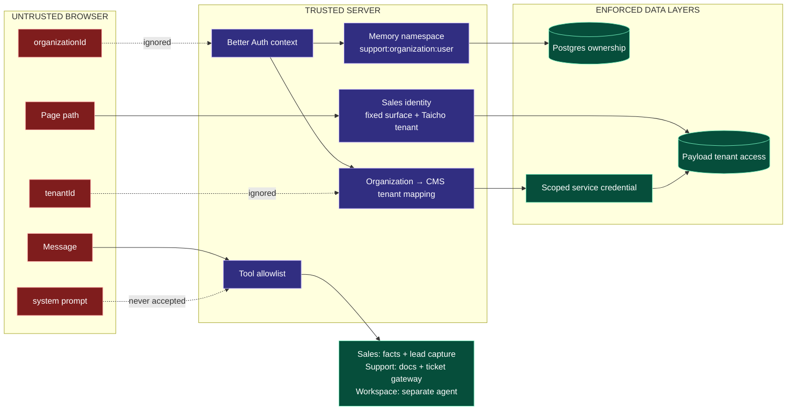

## 9. Code Map

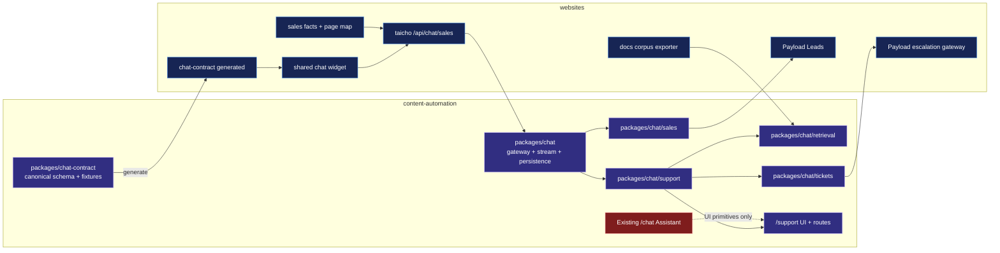

## 10. Delivery

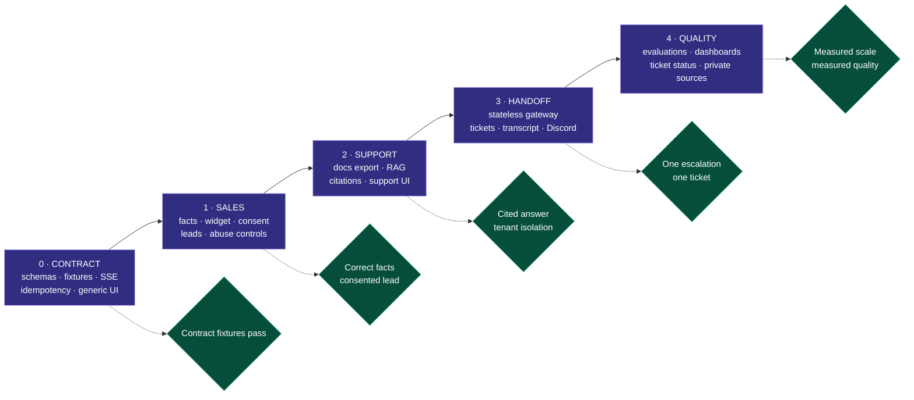
